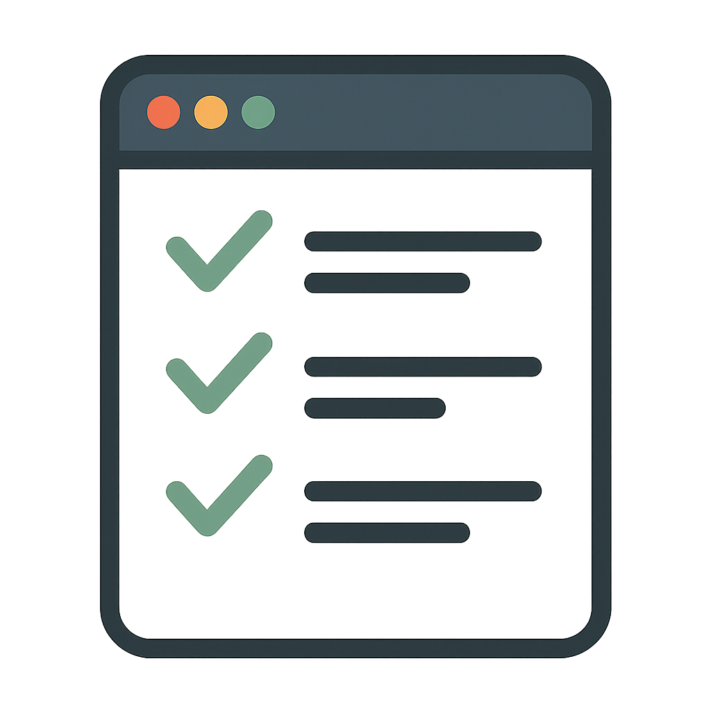

# 📋 Farcaster Todo Mini App

A beautiful, modern todo list application built as a Farcaster Mini App. Stay organized and share your productivity with the Farcaster community!



## ✨ Features

### 🎨 Modern Design
- **Glass-morphism UI** with beautiful gradient backgrounds
- **Dark theme** with purple-to-pink gradients
- **Smooth animations** and micro-interactions
- **Responsive design** that works on all devices
- **Custom scrollbars** and hover effects

### 📱 Core Functionality
- ✅ **Add Tasks** - Create new todos with a sleek input interface
- 🔄 **Toggle Completion** - Mark tasks as complete/incomplete with custom checkboxes
- 🗑️ **Delete Tasks** - Remove individual tasks with hover-to-reveal delete buttons
- 📊 **Live Statistics** - Track total, completed, and pending tasks in real-time
- 🧹 **Clear Completed** - Bulk remove all completed tasks

### 🚀 Farcaster Integration
- 🎉 **Share Progress** - Post your completion stats to Farcaster
- 📋 **Share Todo List** - Share your entire todo list with the community
- 👤 **User Profile** - Display your Farcaster profile picture and name
- 🔗 **Deep Linking** - Opens Warpcast compose window with pre-filled messages

### 🛡️ Error Handling
- ⏳ **Loading Screen** - Beautiful animated loading state
- ❌ **Error Screen** - Elegant error handling with retry options
- 🔄 **Graceful Fallbacks** - App works even if Farcaster features fail

## 🚀 Getting Started

### Prerequisites
- Node.js 18+ 
- npm or yarn
- Farcaster account (for sharing features)

### Installation

1. **Clone the repository**
   ```bash
   git clone https://github.com/yourusername/farcaster-todo.git
   cd farcaster-todo
   ```

2. **Install dependencies**
   ```bash
   npm install
   ```

3. **Start the development server**
   ```bash
   npm run dev
   ```

4. **Open your browser**
   Navigate to `http://localhost:5173`

### Building for Production

```bash
npm run build
```

The built files will be in the `dist` directory.

## 🏗️ Tech Stack

### Frontend
- **React 18** - Modern React with hooks
- **Vite** - Lightning-fast build tool
- **Tailwind CSS** - Utility-first CSS framework
- **React Router** - Client-side routing

### Farcaster Integration
- **@farcaster/miniapp-sdk** - Official Farcaster Mini App SDK
- **Custom hooks** - Encapsulated Farcaster logic

### Design
- **Glass-morphism** - Modern UI design trend
- **Custom animations** - Smooth CSS keyframe animations
- **Responsive design** - Mobile-first approach

## 📁 Project Structure

```
src/
├── components/          # Reusable UI components
│   ├── Header.jsx      # App header with user profile
│   ├── Stats.jsx       # Statistics display with share button
│   ├── TodoInput.jsx   # New task input form
│   ├── TodoItem.jsx    # Individual todo item
│   ├── TodoList.jsx    # Todo list container with actions
│   ├── LoadingScreen.jsx # Loading state component
│   └── ErrorScreen.jsx # Error state component
├── hooks/              # Custom React hooks
│   ├── useTodos.js     # Todo state management
│   ├── useFarcaster.js # Farcaster SDK integration
│   └── useFarcasterActions.js # Share functionality
├── Routes/             # Page components
│   └── HomePage.jsx    # Main app page
├── Layout/             # Layout components
│   └── MainLayout.jsx  # App layout wrapper
└── index.css          # Global styles and animations
```

## 🎨 Design Philosophy

### Color Palette
- **Primary Gradient**: Indigo (900) → Purple (900) → Pink (900)
- **Accent Colors**: Blue, Purple, Green, Orange with transparency
- **Text**: White with various opacity levels for hierarchy

### Typography
- **Font**: Montserrat - Modern, clean, highly readable
- **Hierarchy**: Multiple font sizes and weights for clear information structure

### Animations
- **Fade-in-up** animations for todo items
- **Hover effects** with scale and shadow transitions
- **Staggered delays** for list item animations
- **Pulse effects** for decorative elements

## 🔧 Configuration

### Tailwind CSS
The app uses a custom Tailwind configuration with:
- Custom animations
- Glass-morphism utilities
- Scrollbar styling
- Extended color palette

### Vite Configuration
Optimized for:
- Fast development server
- Efficient bundling
- Asset optimization

## 📱 Farcaster Integration

### Share Progress
When users complete tasks, they can share their progress:
```
"Just completed 3 out of 5 tasks on my Farcaster Todo app! 🎉"
```

### Share Todo List
Users can share their entire todo list formatted as:
```
My current todo list:

1. ✅ Complete project documentation
2. ⏳ Review pull requests
3. ⏳ Plan next sprint

Staying productive with my Farcaster Todo app! 📋
```

### User Profile
- Displays user's Farcaster profile picture
- Shows personalized welcome message
- Gracefully handles unauthenticated states

## 🛠️ Development

### Available Scripts
- `npm run dev` - Start development server
- `npm run build` - Build for production
- `npm run preview` - Preview production build
- `npm run lint` - Run ESLint

### Code Style
- **ESLint** configuration for consistent code style
- **Prettier** formatting (recommended)
- **Component-based** architecture
- **Custom hooks** for state management

## 🚀 Deployment

### Vercel (Recommended)
1. Connect your GitHub repository to Vercel
2. Configure build settings:
   - Build Command: `npm run build`
   - Output Directory: `dist`
3. Deploy automatically on every push

### Netlify
1. Connect repository to Netlify
2. Set build command: `npm run build`
3. Set publish directory: `dist`

### Manual Deployment
1. Run `npm run build`
2. Upload `dist` folder contents to your web server

## 🤝 Contributing

1. Fork the repository
2. Create a feature branch: `git checkout -b feature/amazing-feature`
3. Commit your changes: `git commit -m 'Add amazing feature'`
4. Push to the branch: `git push origin feature/amazing-feature`
5. Open a Pull Request

## 📄 License

This project is licensed under the MIT License - see the [LICENSE](LICENSE) file for details.

## 🙏 Acknowledgments

- **Luna** - Original creator and designer
- **Farcaster Team** - For the amazing Mini App SDK
- **Tailwind CSS** - For the utility-first CSS framework
- **React Team** - For the fantastic React library

## 📞 Support

If you encounter any issues or have questions:
1. Check the [Issues](https://github.com/yourusername/farcaster-todo/issues) page
2. Create a new issue with detailed information
3. Join our community discussions

---

**Made with ❤️ by Luna for the Farcaster community**

*Stay organized, stay productive! 🚀*
